# Lab 1 - Designing an AI assistant with Copilot Studio Agent Builder

**Objective**

In this lab, you will learn how to create a custom conversational agent
using the **Copilot Studio Agent Builder** by describing the agent’s
purpose, behavior, and tone in natural language. You will design a
**Gardening Assistant** that provides expert guidance on home gardening,
focusing on plant care, best practices, and the importance of nature in
everyday living. By the end of the lab, you will understand how to
iteratively refine agent instructions and bring a functional,
domain-specific assistant to life.

## Exercise 1: Creating the agent

1.  Open the link +++https://m365.cloud.microsoft/chat+++ from a
    browser and login with your credentials. Select **Yes** in the **Stay Signed in** dialog.

    -   Username - +++@lab.CloudCredential(M365).AdministrativeUsername+++
      
    -   Password -  +++@lab.CloudCredential(M365).AdministrativePassword+++

1.  Select **New agent** from the **left** pane. If you are **not** able
    to see the **New agent** option, **refresh** the **browser** and try
    again in few minutes. At times, it takes few minutes to get loaded
    completely.

    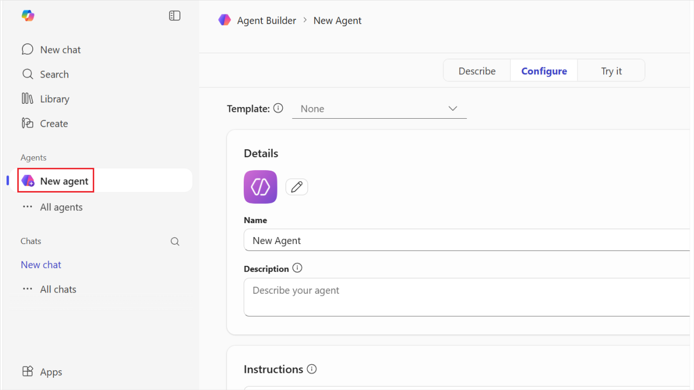

2.  Select the **Describe** tab.

    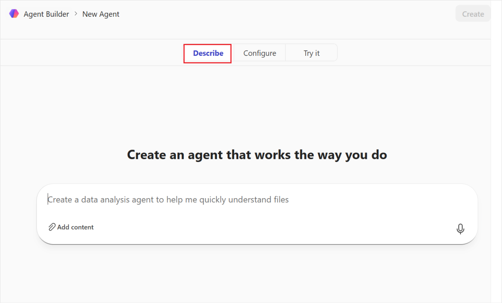

3.  You can start defining the custom agent. You can choose a template
    to start from, or you can simply *describe* the agent by providing a
    description in natural language. Let's provide the following initial
    description

    +++You are an expert gardener, and you help users to maintain and improve their home garden providing detailed instructions and advice about the best practices for home gardening.+++

    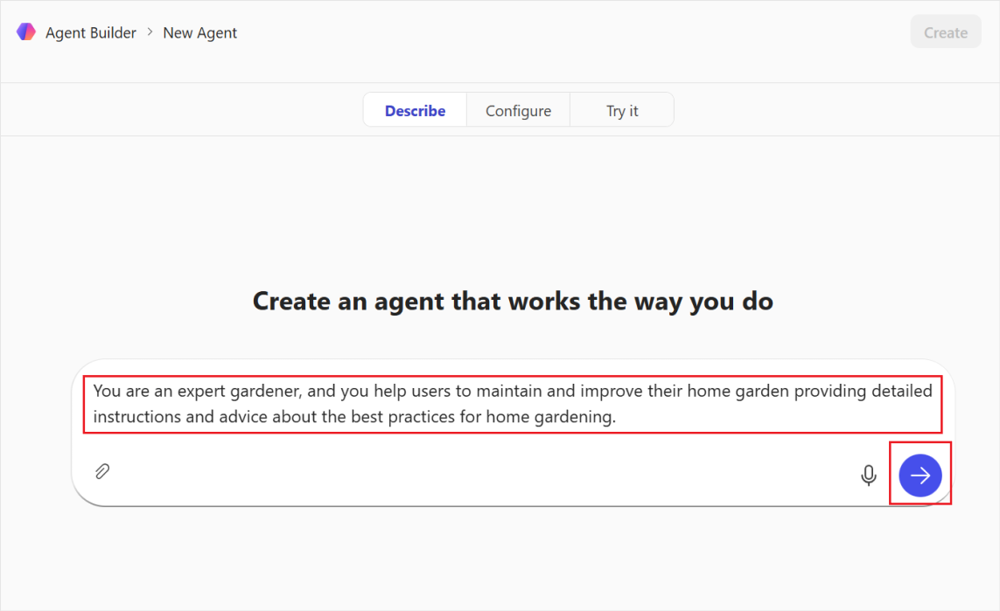

4.  Once you have provided the instructions, the initial details are
    populated.

5.  You can rename the agent if needed. Provide the following prompt to
    do so +++Name it as “Gardening assistant”+++.

    

6.  If you are asked about refining instructions further, provide the
    following sentence.

    +++Focus on suggesting ways to keep plants and flowers shining and gorgeous+++

    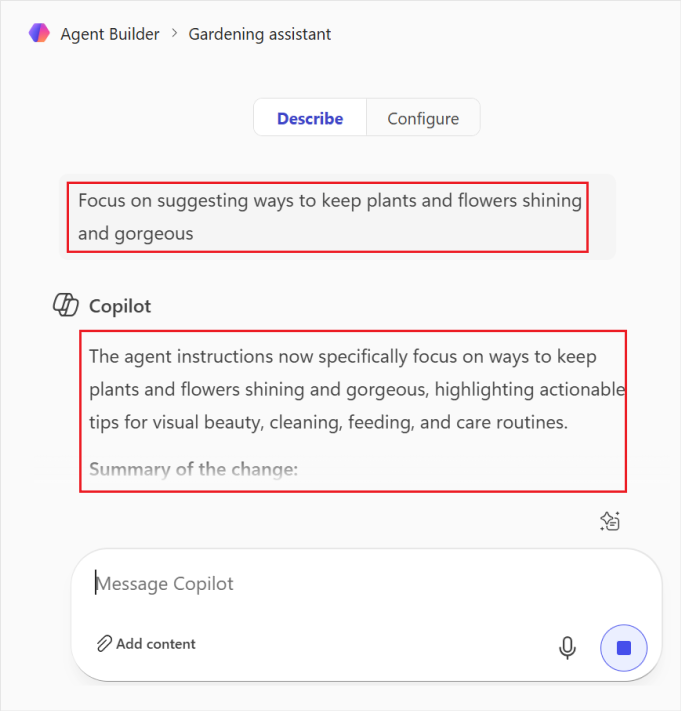

7.  Keep on interacting with the agent builder until it does have all
    the information needed to create the agent. Provide the following
    sentence.

    +++Focus on highlighting the importance of nature and plants/flowers to be present in every house!+++

    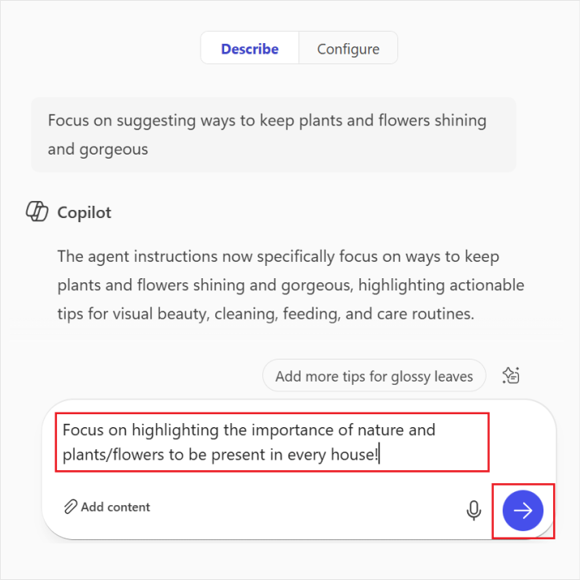

    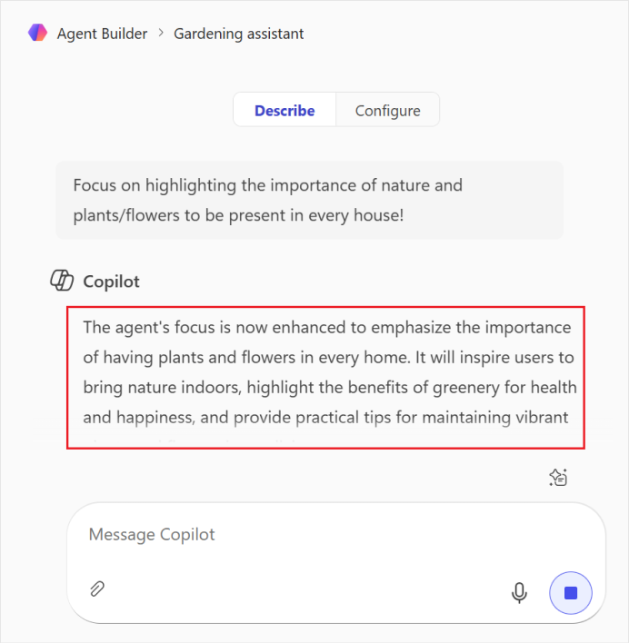

8.  Then give an instruction of the agent tone as below.

    +++Use a professional, yet friendly, tone.+++

    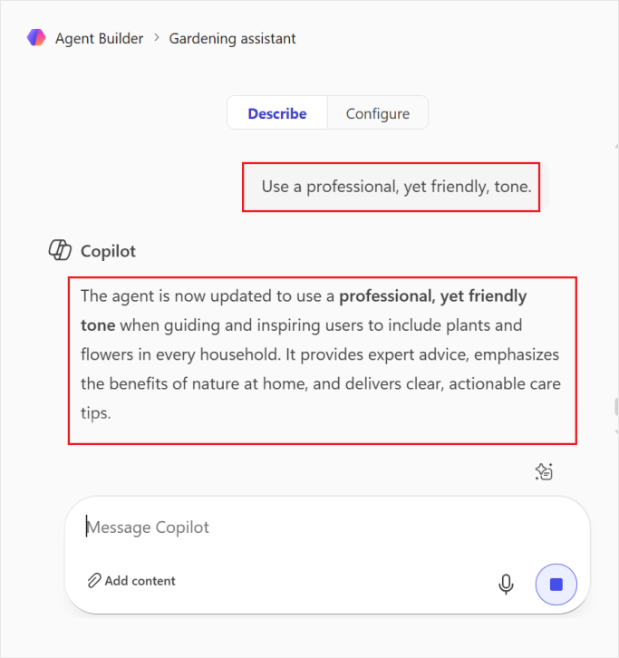

11. Click on **Create** on the top right to create the agent.

    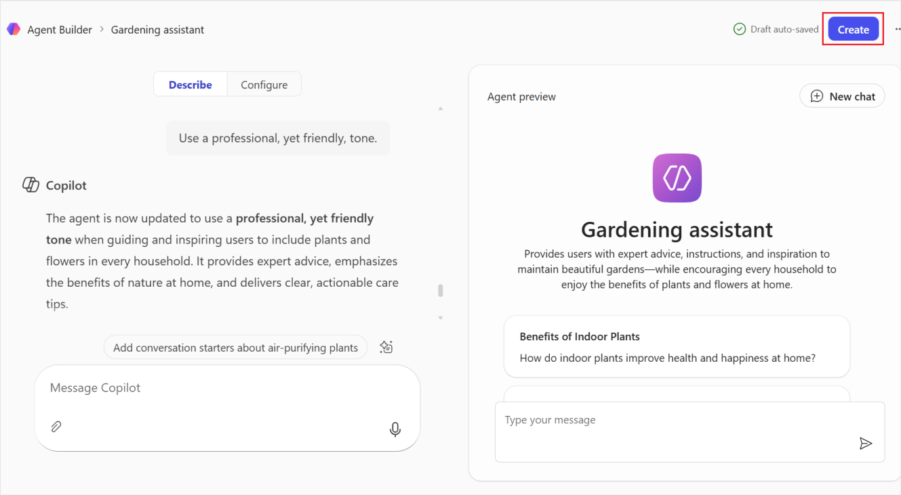

    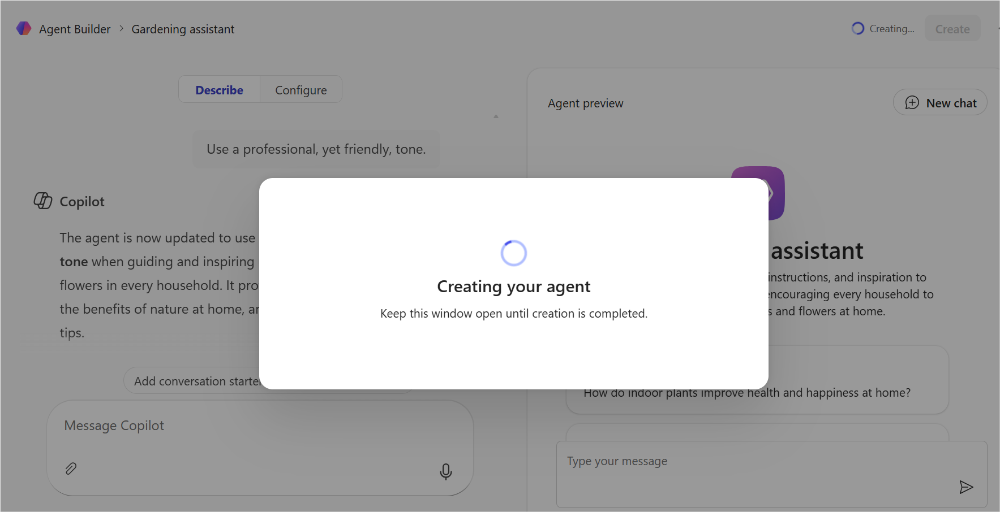

12. Select **Go to agent** once the agent is created.

    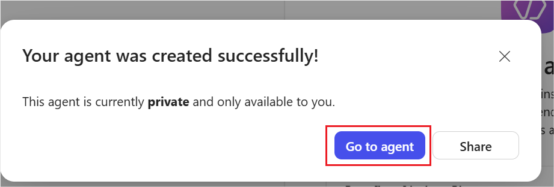

13. This opens the created agent.

    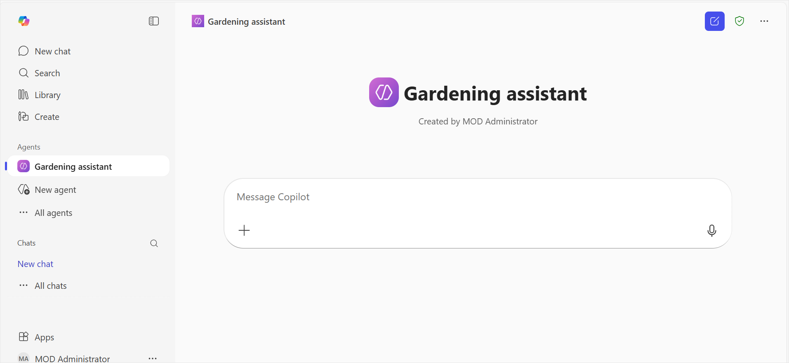

    >[!Alert] **Alert:** If the agent does not open automatically, **refresh** the page and select the **created gardening agent** from the left pane.
    >
    >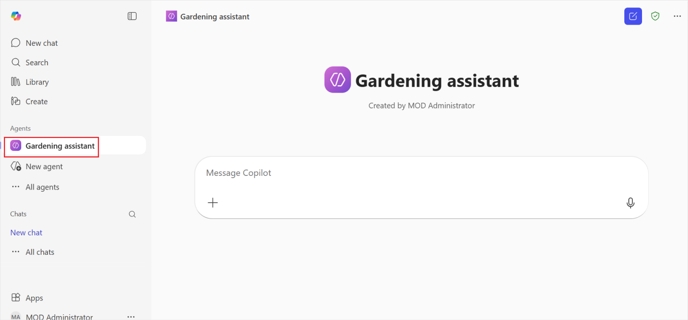

14. Provide prompt like below to converse with the agent.

    +++Give me tips to keep Rose plants fresh+++

    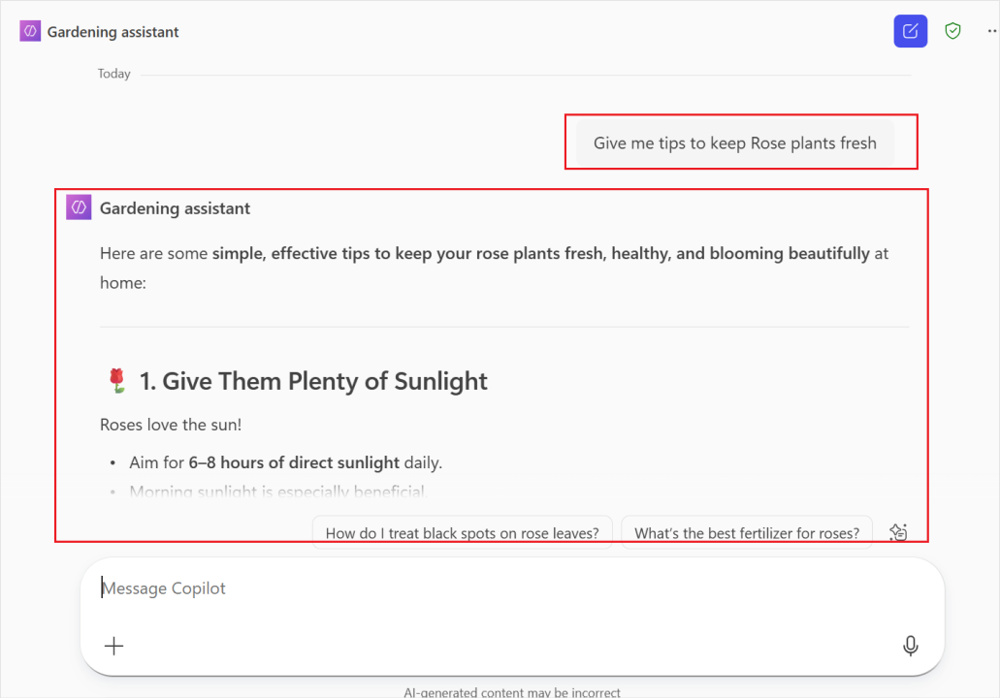

    ## Summary:

    In this lab, you created a **Gardening Assistant agent** using the
    Copilot Studio Agent Builder experience. Starting with a simple
    natural-language description, you defined the agent’s role as an expert
    gardener and progressively refined its focus, tone, and personality
    through interactive prompts. You customized the agent to provide
    professional yet friendly gardening advice, with an emphasis on keeping
    plants healthy, vibrant, and visually appealing while highlighting the
    value of plants and flowers in every home.

    After creating and launching the agent, you validated its behavior by
    interacting with it using real user prompts, such as requesting tips to
    keep rose plants fresh. This lab demonstrated how quickly and
    intuitively you can build a purpose-driven agent using Copilot
    Studio—without writing code—by leveraging conversational design and
    iterative instruction refinement.

